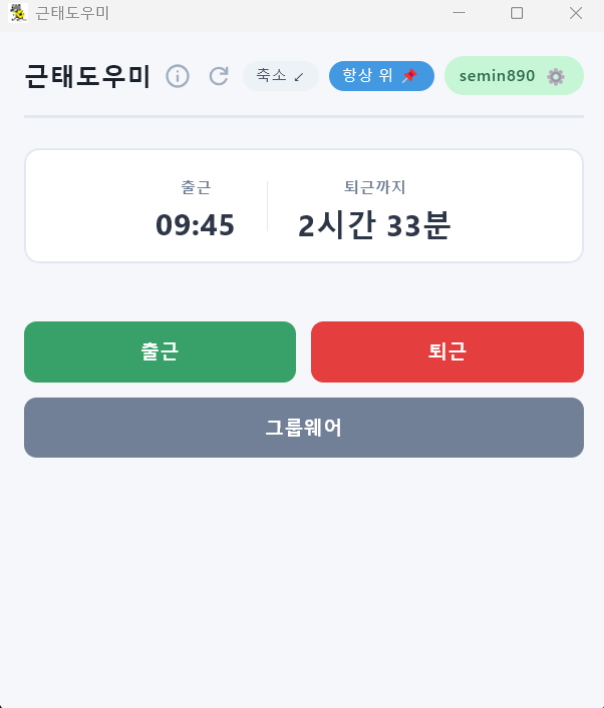
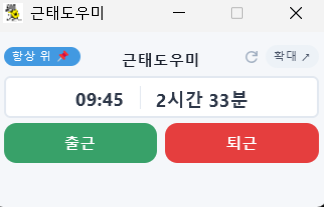

# 근태도우미

파인원 그룹웨어 출퇴근 도우미 데스크톱 앱

## 스크린샷

| 기본 모드 | 축소 모드 |
|:---------:|:---------:|
|  |  |

## 주요 기능

- 원클릭 출근/퇴근
- 퇴근까지 남은 시간 카운트다운
- 축소 모드 (항상 위 지원)
- 자동 업데이트 알림

## 다운로드

[Releases](https://github.com/seminpineone/gw-attendance/releases)에서 최신 버전을 다운로드하세요.

- **Windows**: `.msi` 파일
- **macOS**: `.dmg` 파일
